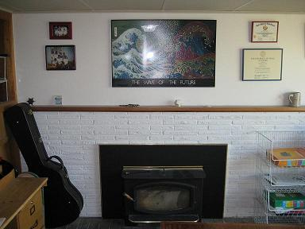

# White Brick Software

When I started dreaming of writing and selling my own software, I knew I would have to have a name and a URL for my organization.  Coming up with a unique domain name that had some version of my name in it turned out to be quite difficult.  "Whitebricksoftware.com" was the first domain name I could think of that wasn't already taken.  I kind of like it, because the room in my current house that I use as my computer room has a wall with a fireplace surrounded by bricks painted white.

